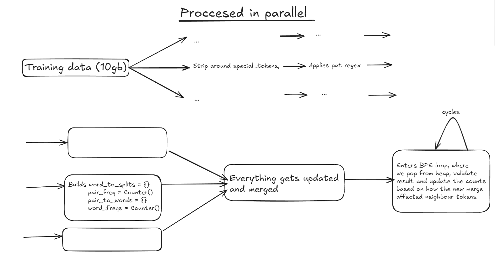
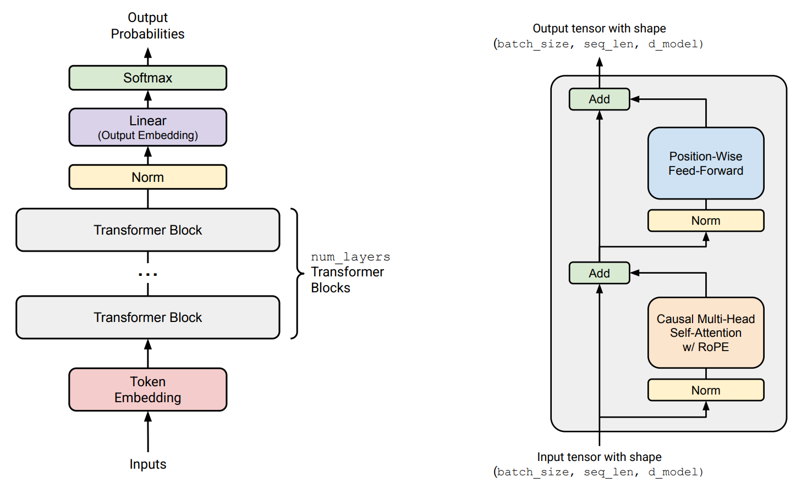
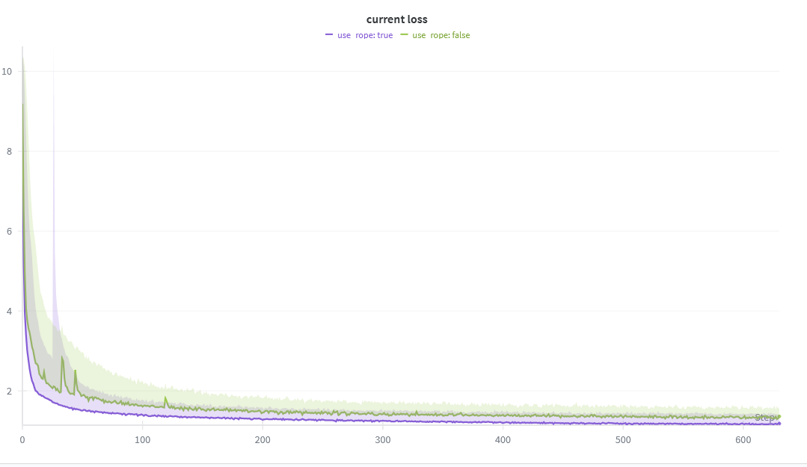
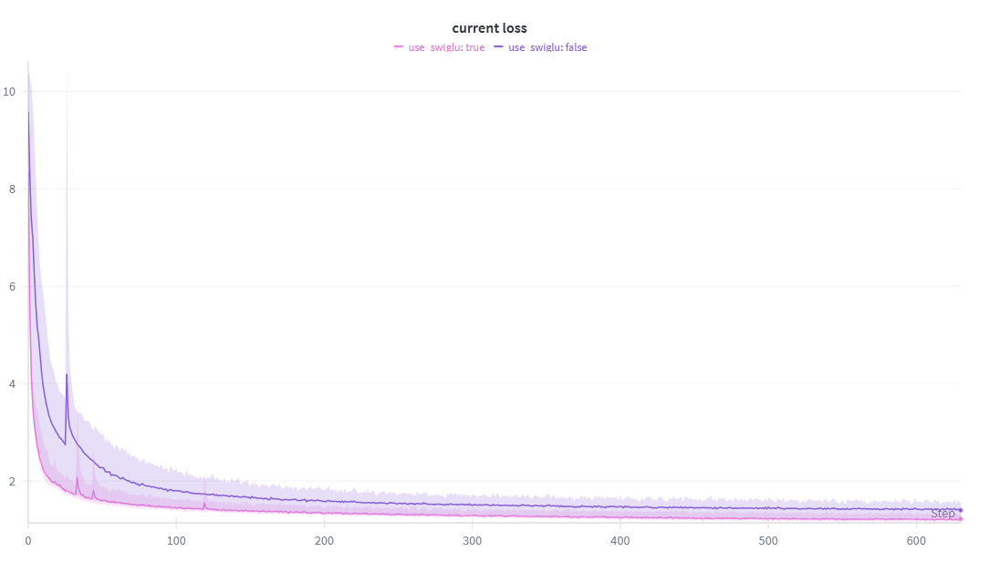
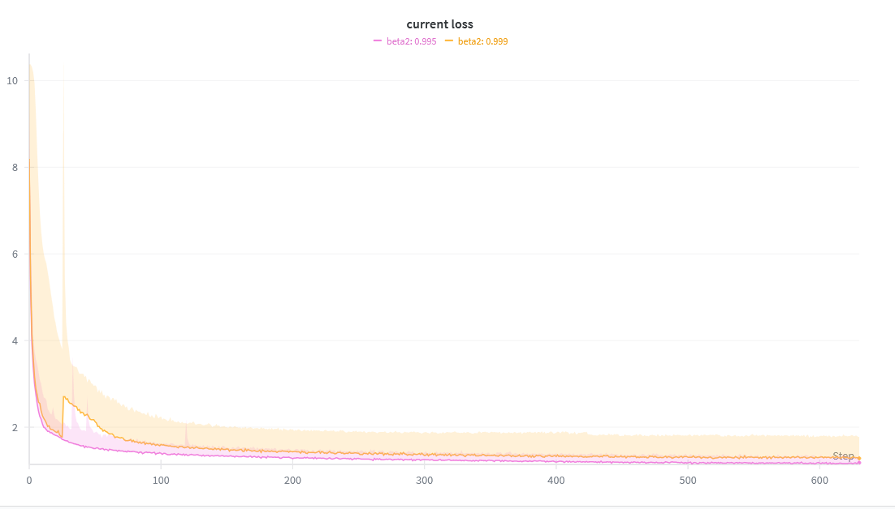
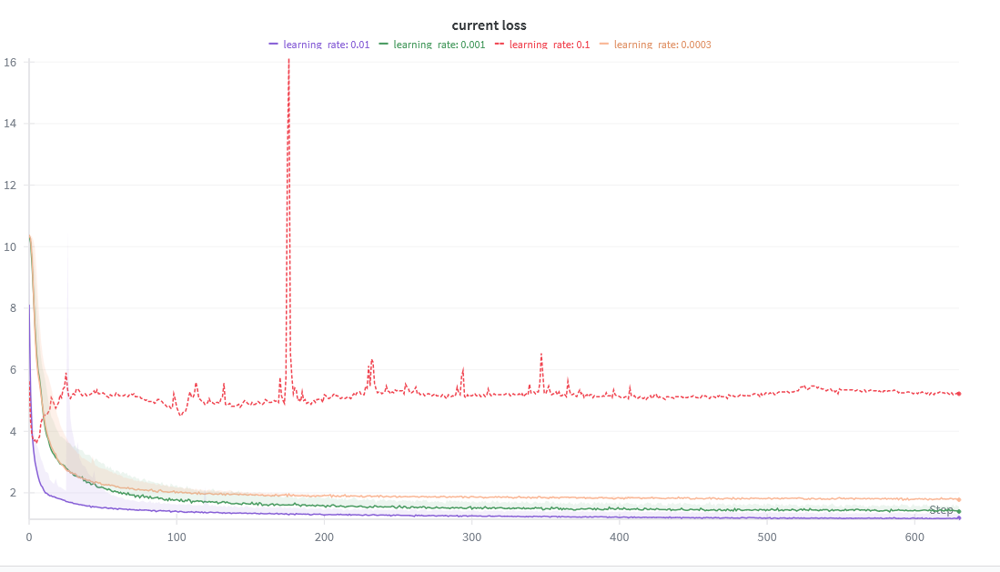

# Implementation of BPETrainer, BPETokenizer, and Transformer "from scratch"

The main motivation for implementing a transformer from scratch is not only to understand how the model itself works, but also to explore how different parameters affect training speed when working with limited GPU resources.
Training on limited GPU also makes u think more about perfomance and how to optimilize pytorch code.

Most of the training has been done on some "budget frinedly" single gpu cluster, with cards like L40s, A40s, some of the work has been done on H100s.

Other reason why I decided to implement that, is because of my bachelors project, which will implement a framework for processing speech via LLM (Work in progress)

---

## Byte Pair Encoding (BPE) – Training the Tokenizer

My implementation in `cs336_basics/trainer_bpe.py` includes a class **`BPETrainer`**, which trains a vocabulary and merge rules on a given text. The class also supports **parallel processing**, making it efficient even on large datasets (10GB+).

---

### Optimizations in the Trainer

The trainer is optimized using several techniques:

- **Heap for highest-frequency pairs**  
  Instead of scanning the entire hashtable each time for (O(n)) timecomplexity, a heap is used to quickly retrieve the most frequent pair.  

- **Unique word tracking**  
  Each "word" is stored only once in a set along with its count. For example, a word that appears 1,000+ times is still processed just once. This saves both memory and computation.  

- **Efficient pair-to-word mapping**  
  When merging a pair of tokens, we can instantly find all affected words via a hashtable that maps each pair to the set of words containing it. This avoids redundant lookups and speeds up training significantly.  

The whole trainer could be summarized by this algorithmic description:

### Steps

1. **Initialization**
   - Initialize vocabulary with all 256 possible single-byte tokens and "setting" how many merges we will have to do.  
   

2. **Chunk Splitting**
   - Split the input file into `N` chunks.  
   - Ensure splits respect a delimiter (e.g., `<|endoftext|>`).  

3. **Parallel Processing**
   - For each chunk (in parallel):  
     - Tokenize using regex rules and special token boundaries.  
     - For each tokenized word:  
       - Convert to UTF-8 bytes.  
       - Update **word frequency counter**.  
       - Split word into individual bytes.  
       - Update **pair frequency counter** for adjacent bytes.  
       - Record mapping of **pair → set of words** that contain it.  
   - Collect results from all workers and merge them into:  
     - `word_freqs` (global frequency of words)  
     - `word_to_splits` (each word → list of byte tokens)  
     - `pair_freq` (global frequency of pairs)  
     - `pair_to_words` (pair → set of words containing it)  

4. **Heap Initialization**
   - Build a max-heap of pairs sorted by frequency (`pair_freq`).  

5. **Merge Loop** 
   1. Pop the most frequent pair `(a, b)` from the heap.  
   2. Verify frequency matches current `pair_freq`; if outdated, skip and repeat.  
   3. Define a new token which is concat of the two byte sequences, and adding it to the vocabulary.  
   4. Append `(a, b)` to the merge list.  
   5. For each word containing `(a, b)`, seen in `pair_to_words`:
      - Replace all `(a, b)` occurrences in its split with the new token.  
      - Update surrounding pairs:
        - `(prev, new_token)` replaces `(prev, a)`  
        - `(new_token, next)` replaces `(b, next)`  
      - Update `pair_freq` accordingly (increment new pairs, decrement old ones).  
      - Maintain heap consistency by pushing updated pair counts.  

6. **Finalize Vocabulary**
   - Add special tokens at the end of the vocabulary.  

### Training Results

While training my own vocabulary and merge rules, I managed to get the following results:

- **TinyStories dataset (2GB)** – with a vocabulary size of 10,000, training took **6.38 minutes** on 8 CPUs (no GPUs) using parallel preprocessing.  
- **OpenWebText dataset (10GB+)** – with a vocabulary size of 50,000, training took around **26 minutes** on 16 CPUs, with RAM usage staying under 100GB.  

The table below shows a comparison between my trained tokenizers and the GPT-2 tokenizer (vocab size 50,267).  

It reports the **average number of bytes represented per token** from randomly sampled text.

| Dataset      | File Size (bytes) | OWT Trained | TS Trained | GPT-2 Pretrained |
|--------------|-------------------|-------------|------------|------------------|
| OWT          | 31,487            | **4.8189**  | 3.1892     | 4.7143           |
| TinyStories  | 7,435             | 4.0430      | **4.1146** | 4.0276           |

## Transformer from Scratch

In `cs336_basics/transformers/modules` you can find the following components implemented from scratch, which together enable a successful forward pass:

- `Linear` class  
- `Embedding` class  
- `RMSNorm`  
- `SwiGLU` class  
- `RoPE` class  
- `softmax` function  
- `scaled_attention` function (with support for custom masks)  
- `MultiheadSelfAttention` class, with and without RoPE  
- `TransformerBlock` class, featuring two RMSNorm layers (pre-norm), one MHA, and one SwiGLU network  
- `TransformerLM` class, which stacks the above Transformer blocks and supports checkpointing  

In `data` u can find `encode_train.py`, `inference.py`, `validate.py` which are scripts used to train, evaluate and inference. The inference implements nucleus sampling, top-k sampling and greedy sampling.

The architecture of the implemented transformer is shown in the diagram below:

This architecture is a little bit different than the one introduced in "Attention is all u need" (https://arxiv.org/abs/1706.0376). First it uses pre-norms instead of post-norms, which is very common in modern architectures.

## Experiments with the architecture

When choosing architecture for llm, some parameters or architecture modification drastically improves training stability. Following plots shows what has been tested and what conclusion have been made. All the experiments have been done on tinystories dataset.

- For training the RoPE configurations on average converged more and faster.
- The best performing model also used RoPE

- The configuration that do not use SwiGLU uses just FFN as in "Attention is all u need"
- For training the SwiGLU configurations on average converged more and faster.
- The best performing model also used SwiGLU

- Comparing beta2 value for AdamW optimizer. The value 0.995 was used to train facebook LLama models and it was performing better than the classic 0.999.

- Comparasion of few lr values. The classic 0.01 was the most promising during training.

The best performing model has following configuration, that has reach loss of **1.20** and with the following configuration: 

- batch_size:512
- beta1:0.9
- beta2:0.995
- context_length:256
- d_model:512
- learning_rate:0.01
- num_heads:16
- num_layers:4
- theta:10,000
- use_rope:true
- use_swiglu:true
- vocab_size:32,000
- weight_decay:0.01

## Conclusion 

This repository is implementation of Transformer, BPETrainer and Tokenizer based on Standford cs336 assigment. It helped me understand how pytorch functions are implemented under the hood. It has managed to passed all the tests given by Standford.